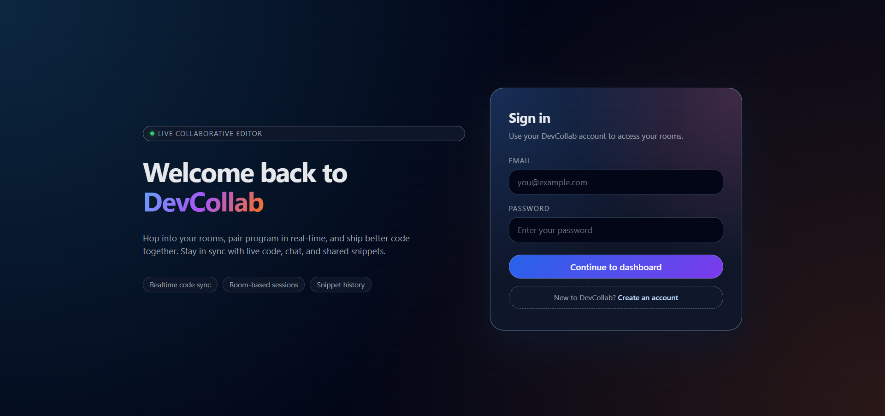
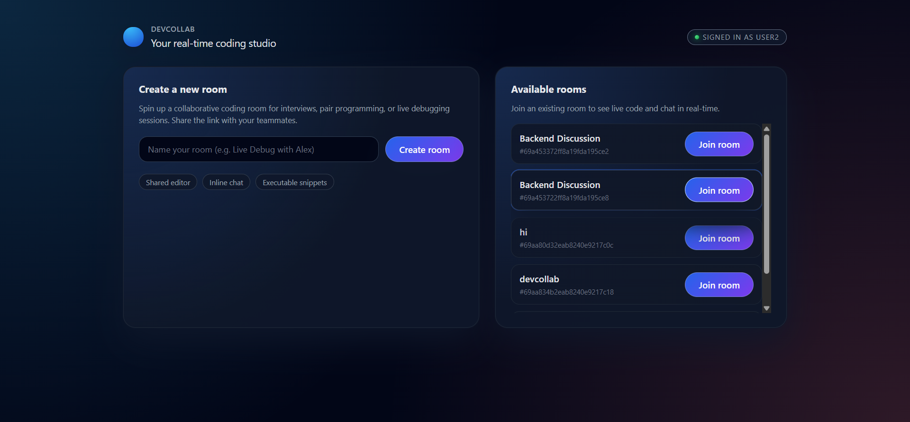
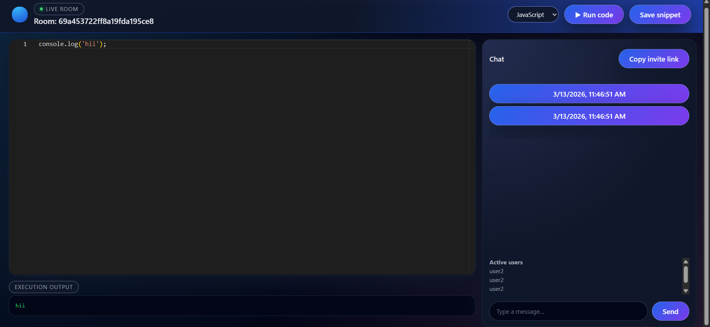
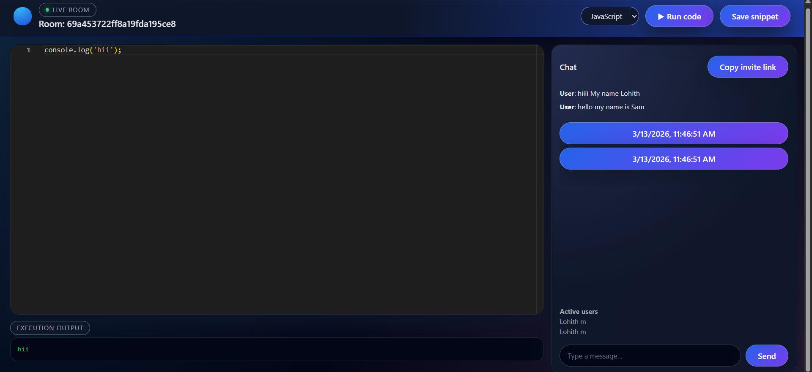

# DevCollab 🚀


DevCollab is a **real-time collaborative coding platform** where multiple users can join a room, write code together, chat, and execute code securely inside Docker containers.

This project was built to explore **real-time systems, containerized execution, and collaborative editors.**

---

## ✨ Features

- 👨‍💻 Real-time collaborative code editing
- 💬 Built-in chat system for each room
- 🧠 Multi-language code execution (Python & JavaScript)
- 🔐 JWT authentication
- 📦 Docker sandbox for secure code execution
- 📂 Save and retrieve code snippets
- 👥 Active users list
- 🔗 Invite link to join rooms
- ⚡ Fast WebSocket synchronization using Socket.IO

---

## 🏗️ Tech Stack

### Frontend
- React
- Vite
- Monaco Editor
- Socket.IO Client

### Backend
- Node.js
- Express
- Socket.IO
- MongoDB

### DevOps / Infrastructure
- Docker
- Docker Compose

---

## 📸 Screenshots

### Login Page



### Dashboard



### Collaborative Editor



### Real-time Collaboration



---

## ⚙️ Architecture Overview

DevCollab uses a **room-based architecture**  powered by Socket.IO.

1. Users join a room.
2. Code changes are emitted as WebSocket events.
3. The server broadcasts updates to other users in the same room.
4. Code execution requests are sent to the backend.
5. The backend writes the code into a sandbox folder.
6. Docker containers execute the code securely.
7. Output is returned to the client.

---

## 🔐 Secure Code Execution

Code execution is isolated using Docker containers:


docker run --rm -v sandbox:/sandbox node:18 node /sandbox/temp.js
docker run --rm -v sandbox:/sandbox python:3.11 python /sandbox/temp.py


This prevents malicious code from affecting the host system.

---

## 🚀 Getting Started

### Clone the repository

```bash
git clone https://github.com/YOUR_USERNAME/devcollab.git
cd devcollab
Setup environment variables

Create .env inside backend:

JWT_SECRET=your_secret_key
SANDBOX_HOST_PATH=/path/to/sandbox
Run with Docker
docker compose up --build

App will run at:

Frontend: http://localhost:5173
Backend: http://localhost:5000
🧠 Future Improvements

CRDT-based collaborative editing

Support for more programming languages

Persistent file storage

Cursor presence indicators

Scalable WebSocket architecture with Redis

👨‍💻 Author

Lohith M

Computer Science Engineering Student

Passionate about full-stack systems and developer tools.
